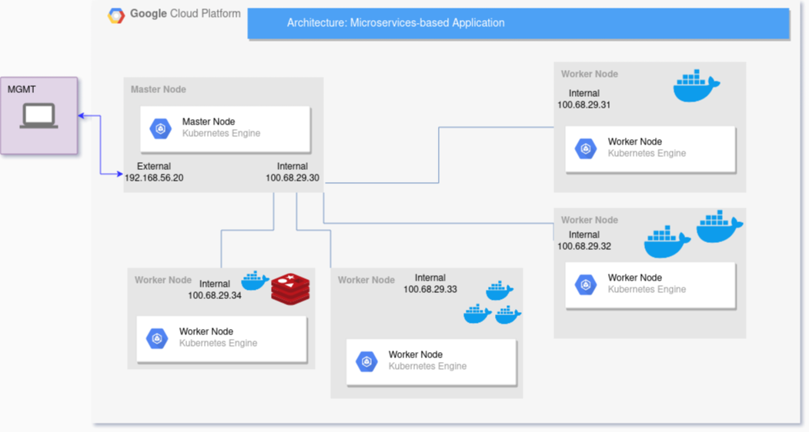

# Project README

AGISIT 20201-2022

## Authors

**Team A43**

  

| Number | Name              | Username                                     | Email                               |
| -------|-------------------|----------------------------------------------| ------------------------------------|
| 81525  | CarlosAntunes      | <https://git.rnl.tecnico.ulisboa.pt/ist181525> | <mailto:carlos.tejedor@tecnico.ulisboa.pt>   |
| 89451  | Guilherme Areias        | <https://git.rnl.tecnico.ulisboa.pt/ist189541> | <mailto:guilherme.areias@tecnico.ulisboa.pt>     |
| 90531  | Pedro Rodrigues  | <https://git.rnl.tecnico.ulisboa.pt/ist190531> | <mailto:pedronevesrodrigues@tecnico.ulisboa.pt> |

## Introduction

The following project from Management and Administration of IT Infrastructures and Services Management and Administration of IT Infrastructures and Services (AGI), consists on the implementation, deployment and provision of a microservice based web application on a public cloud provider. The Browser-based Calculator as a Microservice Architecture was used as the base of the Project in conjunction with the Google Public Cloud Platform Google Cloud Platform (GCP) and the Kubernetes Engine Kubernetes Engine (K8S).

## Solution

The external user makes requests to the application. The Frontend (ingress) receives these requests and redirects them through the internal Internet Protocol (IP) to the designated service. The standard execution of these requests are channeled to VueCalc microservice. Which in turns makes requests to the other microservices. The Spring Boot microservice communicates to the Redis DataStore. The external user can have access to the monitoring service handled by the Grafana and Prometheus software.

## Implementation

The goal of this project is the deployment and provision of a microservice based web application on a public cloud provider. To accomplish this the project infrastructures are built using **Terraform**, with **K8S** and **Docker** behind the scenes as Terraform’s providers, which are hosted on **GCP**. The monitoring services are responsibility of the **Grafana** and **Prometheus** software.

The Web Microservices-based Application has high availability with multiple replicas of each microservice, a Balancing system for the frontend and a DataStore backend.

## Video

Link of the video of the Project-Group-A43: https://www.youtube.com/watch?v=OmaBBIlJqOI
