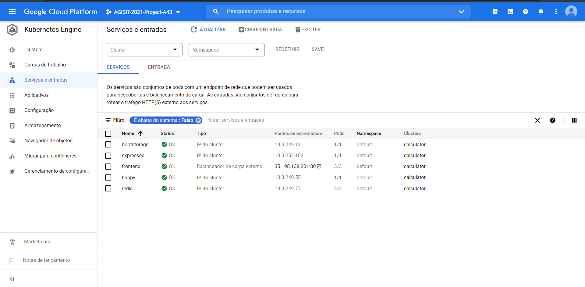
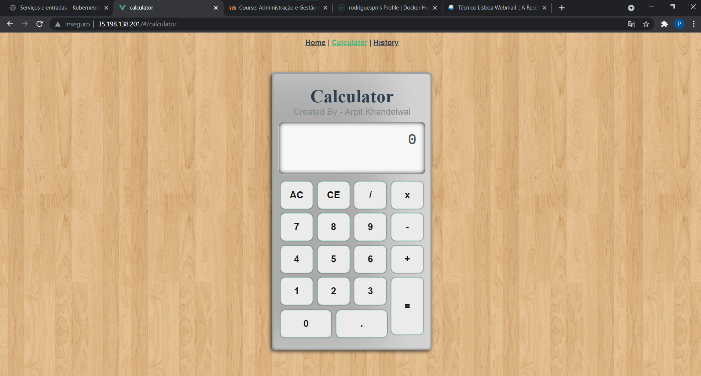

# Project README

AGISIT 20201-2022

## Authors

**Team A43**

  

| Number | Name              | Username                                     | Email                               |
| -------|-------------------|----------------------------------------------| ------------------------------------|
| 81525  | Carlos Antunes      | <https://git.rnl.tecnico.ulisboa.pt/ist181525> | <mailto:carlos.tejedor@tecnico.ulisboa.pt>   |
| 89451  | Guilherme Areias        | <https://git.rnl.tecnico.ulisboa.pt/ist189541> | <mailto:guilherme.areias@tecnico.ulisboa.pt>     |
| 90531  | Pedro Rodrigues  | <https://git.rnl.tecnico.ulisboa.pt/ist190531> | <mailto:pedronevesrodrigues@tecnico.ulisboa.pt> |

## Module Leaders 

- Designing the Architecture of the solution - Pedro.
- Configuration of the Monitoring system - Pedro.
- Definition of the Compute nodes capabilities - Guilherme.
- Networking and Metrics details - Carlos.
- Provisioning of the Infrastructure - Guilherme.
- Deployment of the Applications in the Containers - Carlos.
- Load Balancing strategy - Pedro.

## Pre-Requisites

- Our project will be based on Deploying the Browser-based Calculator as a Microservices Achitecture deployed to a Google Cloud using Kubernetes Engine.
  - https://github.com/khandelwal-arpit/kubernetes-starterkit
- The project name under the Google Cloud Platform is 'AGISIT-2021-Project-A43'.
- Create a new key on Google Cloud Platform and save the credentials on a .json file.
- The file '.tfvars' must be created on the dir 'k8s-project/infrastructure', the file must contain the project id 'AGISIT-2021-Project-A43', the worker nodes count, and the Google Cloud Platform region of deployment.
- The deployment is done on a 'mgmt' VM, with a linux distro 'ubuntu/foscal/', which also includes all the necessary software pre-requisites (Java, mvn, docker, etc).
- The project made of a Kubernetes Orchestration with a combination of Docker Containers.

## Project Files

- The main configuration file is the Vagrantfile. It builds and configures the 'mgmt' virtual machine. 
- The bootstrap.sh contains instructions to install all
dependencies needed on that VM, and sets the environment variables needed.
- In the terraform.tfvars file we have all the variables that will be used in the creation of the Kubernetes Cluster.
- The gcp-gke-main.tf defines the types of the variables region, project and workers_count and then it configures the modules for provisioning and deployment, starting with defining the dependency of the module gcp_k8s from gcp_gke. This makes sense since the module gcp_gke defines the kubernetes cluster and gcp_k8s defines the configuration of the containers and services that will be running on the kubernetes cluster.
- The gcp-gke-provider.tf contains the cluster credentials.
- The gcp-gke-containers.tf contains the definition of Cluster Nodes.
- The k8s-pods.tf contains the specifications of each container as well as which Image it has run.
- The k8s-providers.tf contains the providers and plugins.
- The k8s-services.tf contains the services informations for each Pod.

## Deployment

- Make sure that the Pre-Requisites files mentioned, as well as the Google Cloud Platform configuration are in order.
- The initial deployment is initialized by running the command `vagrant up` in the directory 'team-43A/labs/project/k8s-project'. This command, runs the Vagrant file, wich contains the instructions to setup the working environment.
- When the working environment is created and running, run the command `vagrant ssh mgmt`. After this command you will be logged in to the mgmt machine.
- Next, we run the commands:
  -  `cd k8s-project/infrastructure`
  -  `terraform init`
  -  `terraform apply`

## Solution

- Via a ssh session, a external machine (mgmt) establishes a connection to the Master Node, of the Kubernetes Orchestration, deployed on a Google Cloud Platform server (europa-west3b)
- The Master Node has an external IP and an internal IP.
- Every Worker Node has its own internal IP each is used to communicate bewteen the Master Node as well as other Worker Nodes.
- Each Worker Node can have as many Pods as the Master Node schedules to it. Each Pod can run one or more Docker container.
- The Pods have the Calculator's microservices running, including the Front-end, Back-end, Data Store, and others.

## Implementation Options

- The Web Microservices-based Application has high availability with multiple replicas of each microservice, a Balancing system for the frontend and a database backend service with persistent storage (Redis).

## Final Remarks

- At the moment, the Front-end doesn't communicate with the Back-end.